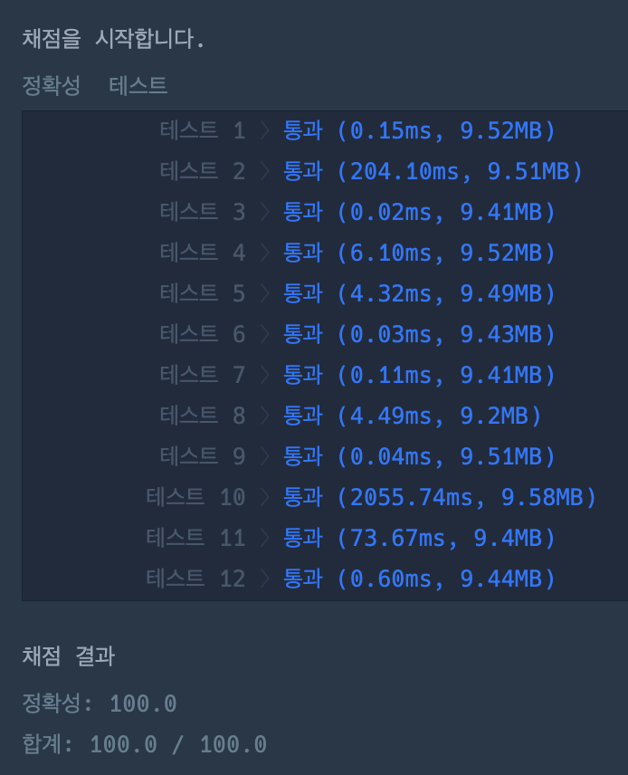

# 문제 풀이

## 🎯 접근 전략

### 1. `numbers`를 단위 숫자로 분리
#### 기본
- `n`개의 숫자 식별
#### 이번 문제
- 최대 `7`개의 숫자 식별
#### 예시
- `17` -> `[1,7]`
- `011` -> `[0,1,1]`

### 2. 각 숫자를 조합하여 만들 수 있는 모든 경우의 수 계산
#### 기본
- `nP1` + `nP2` + ... + `nPn-1` + `nPn`
    - `nP1` = n
    - `nP2` = n x n-1
    - ...
    - `nPn-1` = n x n-1 x ... x 2
    - `nPn` = n x n-1 x ... x 2 x 1
#### 이번 문제
- `7P1` + `7P2` + ... + `7P6` + `7P7`
    - `7P1` = 7
    - `7P2` = 7 x 6
    - ...
    - `7P6` = 7 x 6 x ... x 2
    - `7P7` = 7 x 6 x ... x 2 x 1
#### 예시
- `[1,7]`
    - `2P1`: 1,7
    - `2P2`: 17, 71
- `[0,1,1]`
    - `3P1`: 0,1,1
    - `3P2`: 01,10,01,10,11,11
    - `3P3`: 011,101,110

### 3. `Set`을 이용해서 중복 숫자를 제거
#### 예시
- `[1,7]`
    - `2P1`: 1,7
    - `2P2`: 17, 71
- `[0,1,1]`
    - `3P1`: 0,1
    - `3P2`: 01,10,11
    - `3P3`: 011,101,110

### 4. 모든 경우의 수에 대해 소수 여부를 판단
- `is_prime_number`

### 테스트 결과

---

## ⚠️ Edge Case

- `0`으로 시작하는 경우
    - `str` -> `int` 변환으로 처리

---

## 🕰️ 시간 / 공간 복잡도

### Time Complexity

- min:
    - 
- max:
    - 
- average:
    - 

### Space Complexity

- min:
    - 
- max:
    - 
- average:
    - 

---

## 개선 과제

- `permutations` 라이브러리를 사용하지 않고 순열 로직을 직접 구현할 수 있을까?
- 순열 로직을 직접 구현할 때, `0`으로 시작하는 경우를 사전에 필터링해서 리소스를 절약할 수 있을까?

---

## 🗣️ 마무리

- 내가 느끼는 문제 난이도: 5점
    - 접근 방법을 찾는 것은 쉬움
    - 순열을 코드로 구현하는 방법을 찾지 못함