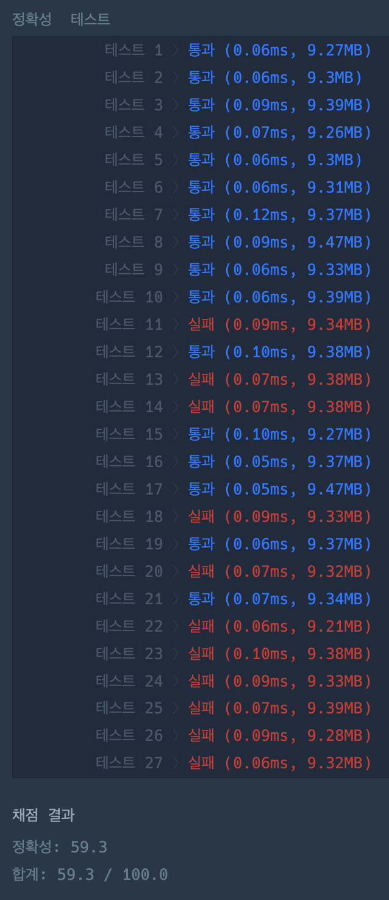

## 🎯 접근 전략

### 총 좌우 이동 횟수 계산 (count_left_right)
    - A가 아닌 글자 중 가장 멀리 있는 글자를 기준으로 필요한 이동 횟수를 계산. 
      오른쪽/왼쪽 방향으로 움직였을 때를 각각 계산한 후 더 작은 값을 최종 결과로 반환.
        - e.g. AAACAAAAAAAATAAAAAAA
    - ⚠️ 첫 글자가 A가 아닌 경우는 제외.
        - e.g. JAZ
    - params
        - name(str): 변경하기 전 문자열
    - returns
        - (int): 이동 횟수
    
### 개별 글자를 완성할 때 필요한 위/아래 이동 횟수 계산 (count_up_down)
    - 전체 알파벳이 26 글자라는 점을 이용해서 위/아래 움직여야하는 방향을 식별한 후 횟수 계산
    - params
        - target_alphabet(str): 완성해야 하는 글자
    - returns
        - (int): 이동 횟수
### 첫번째 글자 완성
- 

### 나머지 글자 완성
- 

### 테스트 결과

---

## ⚠️ Edge Case

- 모든 문자열이 A인 경우
- 좌/우 이동 시 한쪽 방향만 선택하는게 아니라 좌/우 복합적으로 이동하는 경우

---

## 🕰️ 시간 / 공간 복잡도

### Time Complexity

- min:
    - O(n)
- max:
    - O(n)
- average:
    - O(n)

### Space Complexity

- min:
    - O(n)
- max:
    - O(n)
- average:
    - O(n)

---

## 🗣️ 마무리

- 내가 느끼는 문제 난이도: 5