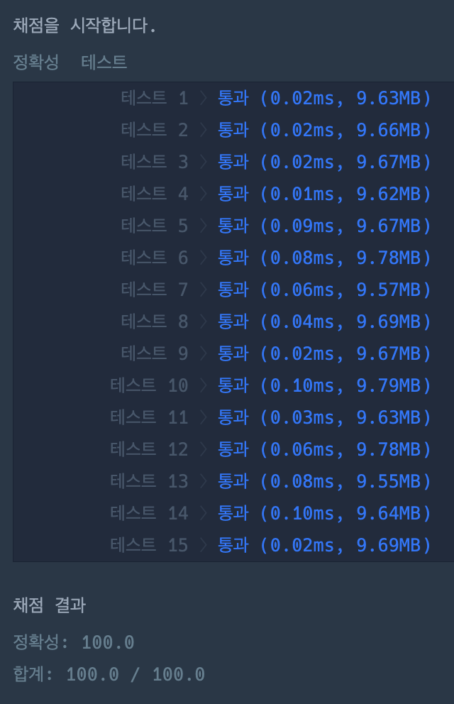

# 문제 풀이

## 🎯 접근 전략

### 1. `GenreType`을 정의

### 2. 타입에 맞게 원본 데이터 가공

- dict 초기화
    ```json
    { 
        "classic": { 
            "total": 0, 
            "songs": [] 
        }, 
        "pop": { 
            "total": 0, 
            "songs": [] 
        } 
    }

    ```

- dict 업데이트
    ```python
    {
        'classic': {
            'total': 1450, 
            'songs': [(0, 500), (2, 150), (3, 800)]
        }, 
        'pop': {
            'total': 3100, 
            'songs': [(1, 600), (4, 2500)]
        }
    }
    ```

### 3. 필요한 순서대로 정렬

- 장르별 총합 기준으로 정렬
    ```python
    {
        'pop': {
            'total': 3100, 
            'songs': [(1, 600), (4, 2500)]
        }
        'classic': {
            'total': 1450, 
            'songs': [(0, 500), (2, 150), (3, 800)]
        }, 
    }
    ```

- 재생 수 기준으로 정렬 후 정답에 추가
    ```python
    [(1, 600), (4, 2500)] -> [(4, 2500), (1, 600)]
    [(0, 500), (2, 150), (3, 800)] -> [(3, 800), (2, 150), (0, 500)]
    ```

### 테스트 결과


---

## ⚠️ Edge Case

- 

---

## 🕰️ 시간 / 공간 복잡도

### Time Complexity

- 전제:
    - 전체 장르(곡) 수:
        - N
        - 최대 10,000개
    - 장르 종류 수: 
        - K
        - 최대 99개

- min:
    - 
- max:
    - 
- average:
    - 전체 장르 순회 = O(N) * 상수
    - 장르별 총 합 기준으로 정렬 = ?
    - 재생 수 기준으로 정렬 = ?

### Space Complexity

- min:
    - 
- max:
    - 
- average:
    - 

---

## 🗣️ 마무리

- 내가 느끼는 문제 난이도: 4
    - `GenreType` 구조를 떠올리는데 시간이 조금 걸렸지만, 구조를 떠올린 이후에는 어렵지 않았다.
    - `cmp_to_key` 사용법이 헷갈려서 검색해봤다.
    
    (1: 매우 쉽다 / 10: 해설을 봐도 이해가 안될 것 같다)