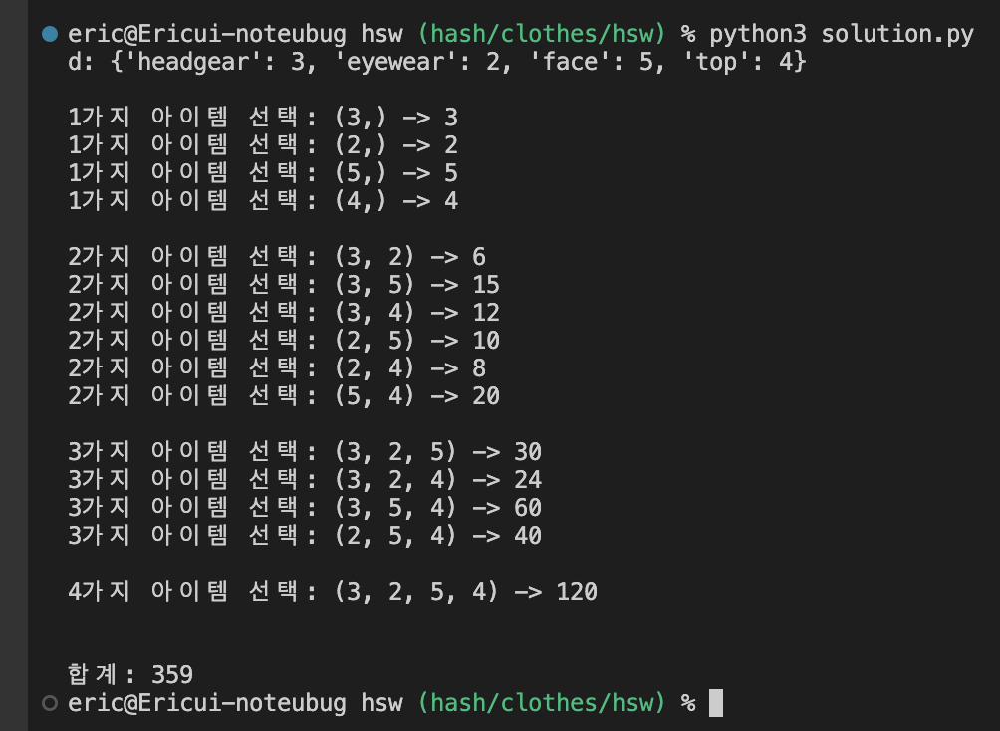
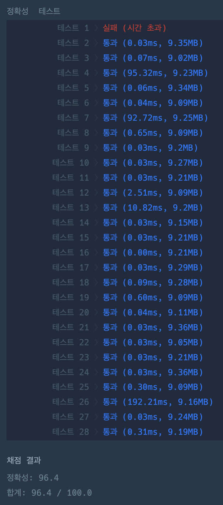

## 🎯 접근 전략

### try 1

1. `collections.Counter`를 활용해서, `clothes`를 **의상의 종류** 기준으로 분류 -> 총 `n`가지의 `category` 식별
 

2. `itertools.combinations`를 활용해서, `1 ~ n`가지 아이템을 고르는 모든 경우의 수를 계산
 

- 실행 화면
    

- 테스트 결과
    

---

## ⚠️ Edge Case

- `len(clothes) == 1`

---

## 🕰️ 시간 / 공간 복잡도

### Time Complexity

- min:
    - 
- max:
    - 
- average:
    - 

### Space Complexity

- min:
    - 
- max:
    - 
- average:
    - 

---

## 🗣️ 마무리

- 내가 느끼는 문제 난이도: 3
    - 접근 방법을 떠올리는 것은 크게 어렵지 않다.
    - 성능 개선 방법이 바로 떠오르지는 않았다.
    
    (1: 매우 쉽다 / 10: 해설을 봐도 이해가 안될 것 같다)

