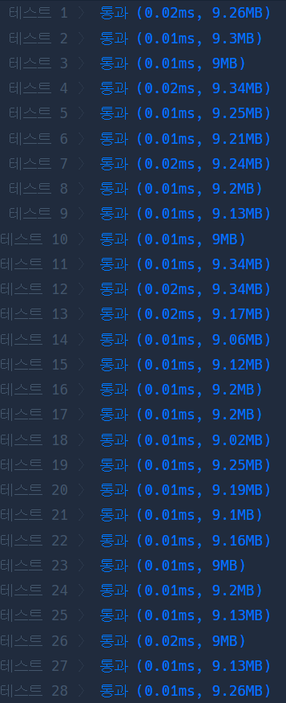

# 문제 풀이

## 🎯 접근 전략
### 초반 풀이
- 첫 풀이와 2번째 풀이는 combinations 사용
    - 첫 풀이: i개를 뽑는 조합에 대해 set(combo) == i일 경우를 셈
        - 통과 최대: 1019.10ms
    - 두 번째: {종류: 갯수}를 담은 dict를 만들고 종류의 조합을 만들어 dict[종류] 값을 곱함
        - 통과 최대: 168.64ms
- 두 풀이 모두 1번 테스트 케이스 TLE 뜸. (1번은 총 5갠가? TLE)
- 두 번째 풀이의 dict에서 '해시'의 목적을 달성했다고 판단
- 조합이 중요한게 아니라 경우의 수가 몇 개인가가 중요함
    - 조합을 쓰는 순간 어지간한 로직은 종류의 개수만큼에 대해 조합을 생성하게 되므로  TLE 가능성 매우 높음
### 여기서부터는 수학적 접근
- 처음엔 파스칼 삼각형을 생각했으나 뇌가 따라오지 못해 폐기
##### 좀 더 원론적인 생각:
- 각 종류에 대해
    - 크게 입거나 안 입거나 2가지
        - 입는다면 dict[type]개의 선택지가 있음
    - --> 각 종류별로 dict[type]+1개의 경우의 수 존재
- 각 종류별 경우의 수를 모두 곱하고 아무것도 안 입는 1가지 경우를 뺌

---

## ✅ 테스트 결과
- 정답률: **100%** (28/28) 
- 실행시간: max = **0.02ms**

---

## ⚠️ Edge Case
- 30종, 1개씩 -> 조합 개수 = $2^{30} -1 \simeq 1B$
    - 조합 생성 이후 어떤 연산을 거칠 것이므로 여기서 시간초과 확정
- 15종, 2개씩 -> 조합 개수 = $3^{15}-1 = 14,348,907$

---

## 🕰️ 시간 / 공간 복잡도

### Time Complexity
- max: 처음 dict로 변환 시 1회 순회가 가장 오래걸림 -> $O(N)$ 

### Space Complexity
- max: 가장 큰 공간은 dict가 차지하므로 $O(keys)$