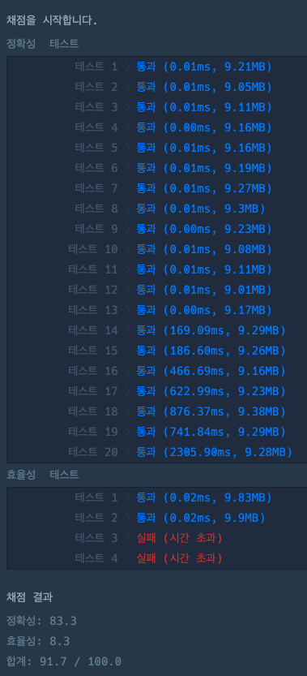
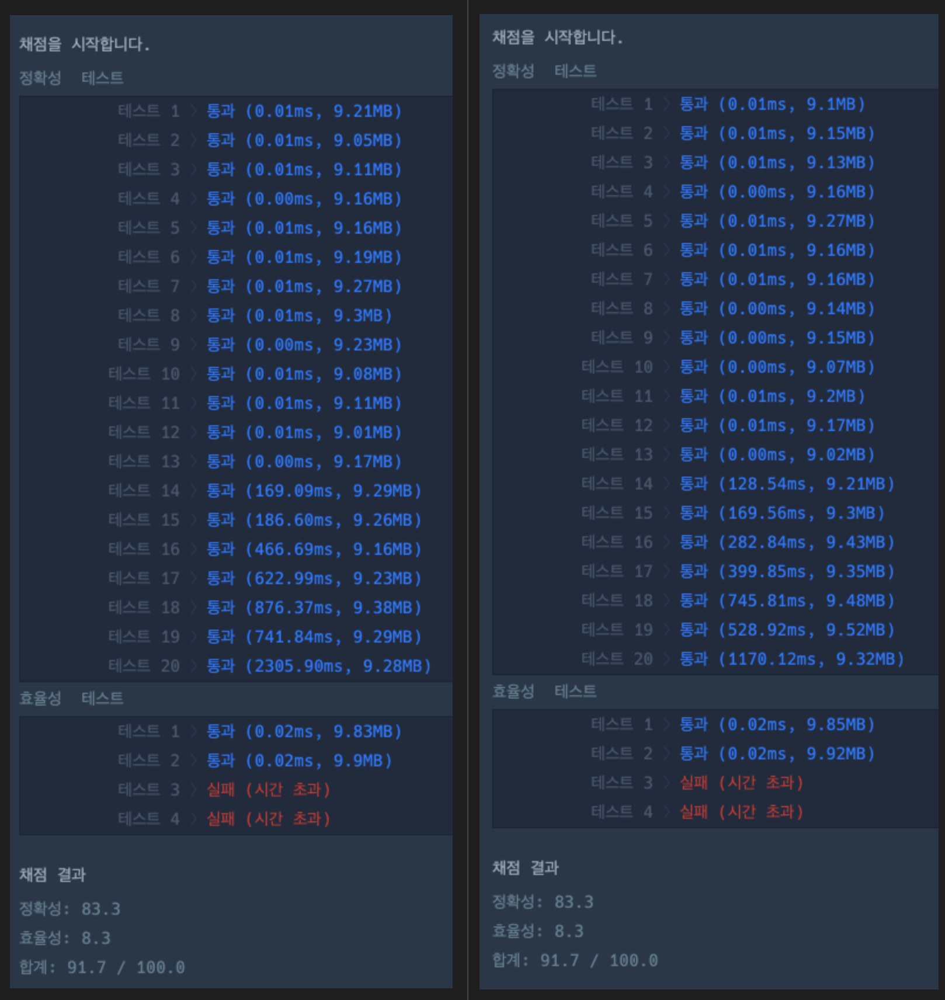
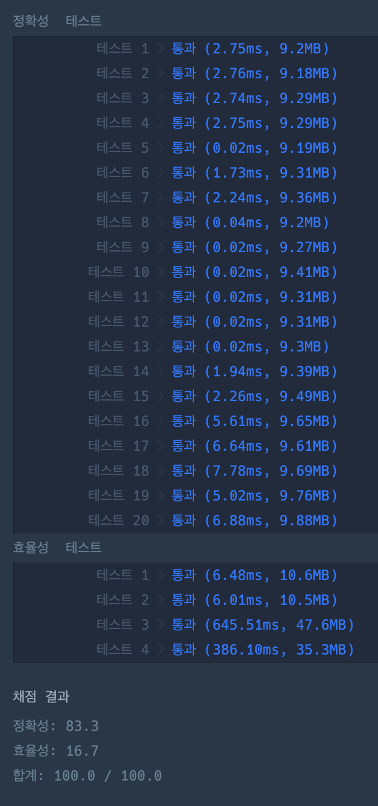

# 문제 풀이

## 🎯 접근 전략

### try 1
- 두 수를 선택한 후, 순서를 바꿔가며 접두어 여부를 확인한다.
- 접두어 여부 확인 함수
    ```python
    def is_dup(num1: str, num2: str):
        return num2.startswith(num1) or num1.startswith(num2)
    ```
- 테스트 결과
    - 성능 테스트 통과 실패
        

### try 2
- 두 수를 선택한 후, 순서를 바꿔가며 접두어 여부를 확인한다.
- 접두어 여부 확인 함수
    ```python
    def is_dup(num1: str, num2: str):
        len1: int = len(num1)
        len2: int = len(num2)

        if len1 < len2:
            return num2.startswith(num1)
        elif len1 > len2:
            return num1.startswith(num2)
        else:
            return num1 == num2
    ```
- 테스트 결과
    - 비교 횟수를 줄여 성능을 개선하였으나 여전히 통과 실패
        

### try 3
- 조회 성능이 좋은 `dictionary` 활용
</br>
- 원본 배열을 `int` 기준 오름차순으로 정렬
    - ["97674223", "1195524421", "119"] -> ["119", "97674223", "1195524421"]
</br>
- 각 숫자를 한자리씩 늘려가며 접두어 중복이 있는지 확인하고, 중복이 없는 경우 `dictionary`에 추가
    - 119
        - 첫번째 숫자
        -> `dictionary`에 추가
    - 97674223
        - 9
        - 97
        - 976
        - ...
        - 97674223
        -> `True` -> `dictionary`에 추가
    - 1195524421
        - 1
        - 11
        - 119
        -> `False`
</br>
- 테스트 결과
    - 통과
        

---

## ⚠️ Edge Case

- 

---

## 🕰️ 시간 / 공간 복잡도

### 전제
```python
len(phone_book) = n
```

### Time Complexity

- min:
    ```python
    phone_book = [1, 11]
    ```
    - 정렬: 원본 배열이 이미 정렬되어 있는 경우 -> `O(1)`
    - 검색: 해시 충돌이 전혀 없는 경우 -> `O(1)`
    - 종합: `O(1)`
- max:
    - 정렬: `Timsort`를 활용한 정렬 -> `O(n logn)`
    - 검색: 모든 해시 값이 하나로 중복되는 경우 -> `O(n)`
    - 종합: `O(n logn)`
- average:
    - 정렬: `Timsort`를 활용한 정렬 -> `O(n logn)`
    - 검색: `O(1)`
    - 종합: `O(n logn)`

### Space Complexity

- `O(n)`

---

## 🗣️ 마무리

- 내가 느끼는 문제 난이도: 4
    - brute-force 접근 전략을 떠올리는 것은 쉽다.
    - 성능 개선 방법이 즉시 떠오르지는 않았다.
- 기타
    - Gemini Code Assist의 리뷰가 기대된다 !
